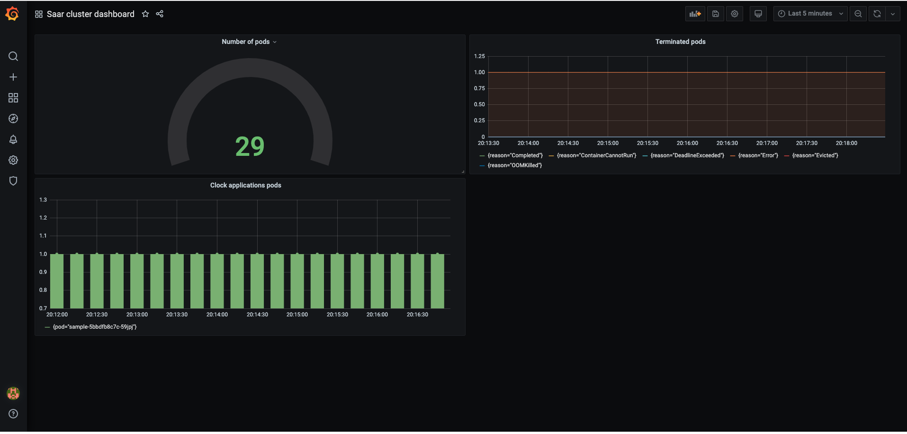
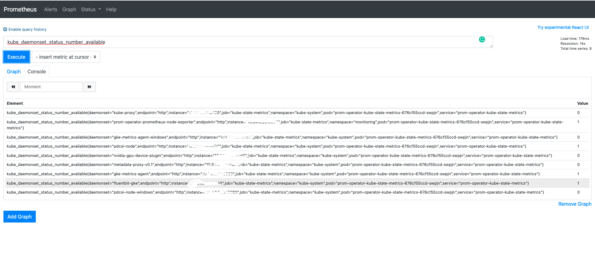

# A simple clock app. Deployment using customizing helm chart.

## Included files:
```
k8s:
    - values.yaml
    - charts
    - templates:
        - service.yaml
        - deployment.yaml
```
- The "values.yaml" contains the environment variables values to keep the template generic as much as possible.
- A simple UI that shows the user the times in cities around the world.
- A helper Makefile for running the commands.

## Usage
### To use with Helm, run:
```
make build-deploy
```

### To locally use, run:
```
make docker-build
```
### To interact with the page via CURL, run:
```
curl http//$IP:80/
```

- The project monitoring by Prometheus and Grafana through this helm repo installation:
```
helm install --name prom-operator stable/prometheus-operator --namespace monitoring
```
Grafana port forwarding:
```
kubectl port-forward -n monitoring prom-operator-grafana-5485f4d565-gwz48 3000:3000
```

Prometheus port forwarding:
```
kubectl port-forward -n monitoring  prometheus-prom-operator-prometheus-o-prometheus-0 9090:9090
```



