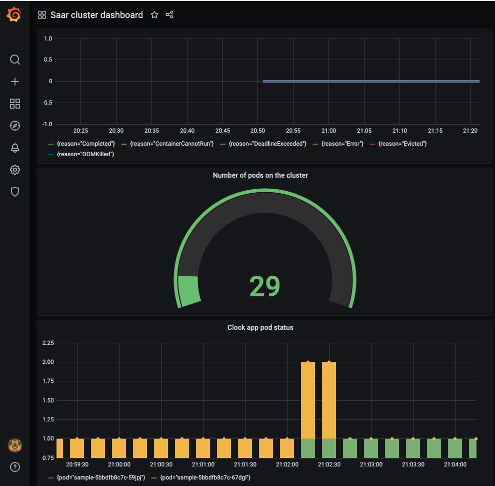

# This Sample-app deployment by customizing helm chart.
# Included files:
#
k8s:
    - values.yaml
    - charts
    - templates:
        - service.yaml
        - deployment.yaml

- The "values.YAML" holds the environment variables values to keep the template generic as much as possible.
- In addition, there is a simple UI that shows the user the times in cities around the world.
- There is a Makefile for running the commands.
- To use with Helm just run:
```
make build-deploy
```

- To locally use, just run:
```
make docker-build
```

- The project monitoring by Prometheus and Grafana through this helm repo installation:
```
helm install --name prom-operator stable/prometheus-operator --namespace monitoring
```
Grafana port forwarding:
```
kubectl port-forward -n monitoring prom-operator-grafana-5485f4d565-gwz48 3000:3000
```

Prometheus port forwarding:
```
kubectl port-forward -n monitoring  prometheus-prom-operator-prometheus-o-prometheus-0 9090:9090
```

"GET" request:
```
curl http//IP:80/
```



