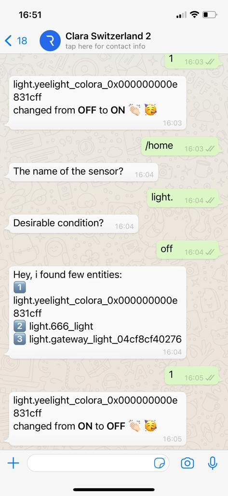
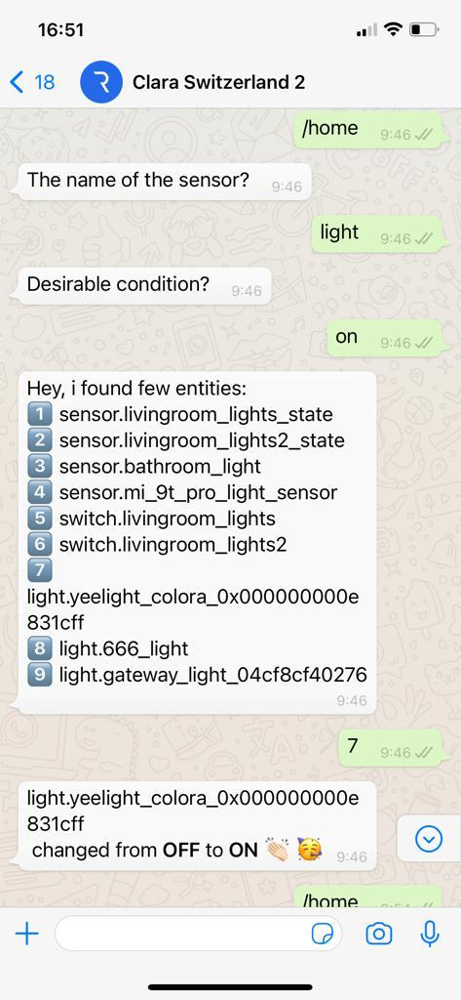
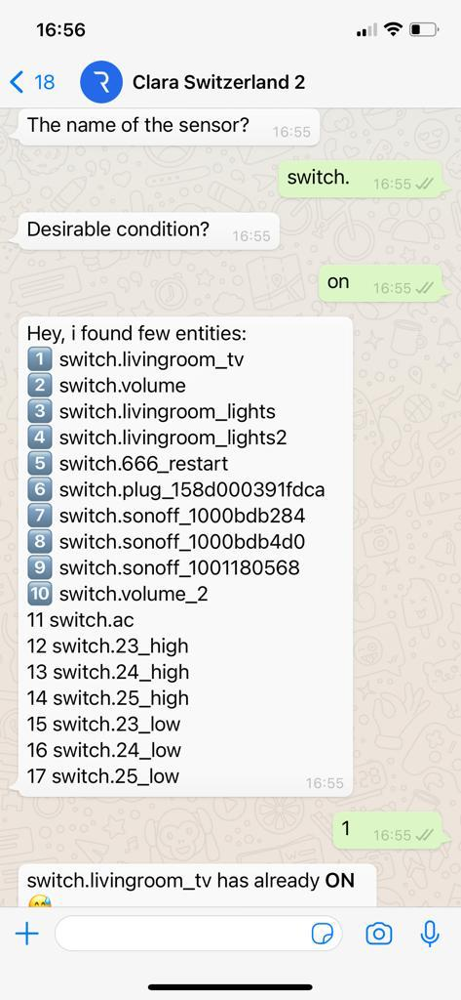

# Home assistant API script.
#
1. The script was made to work with the RELE.AI system.
2. the script returns to the end-user list with sensors, scripts, lights, switches.
3. the users could control the above.

